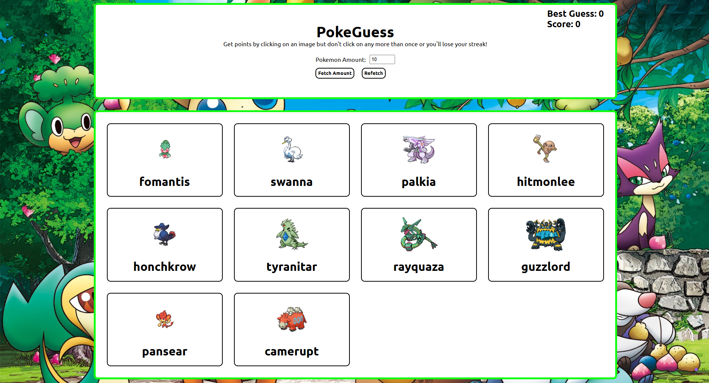
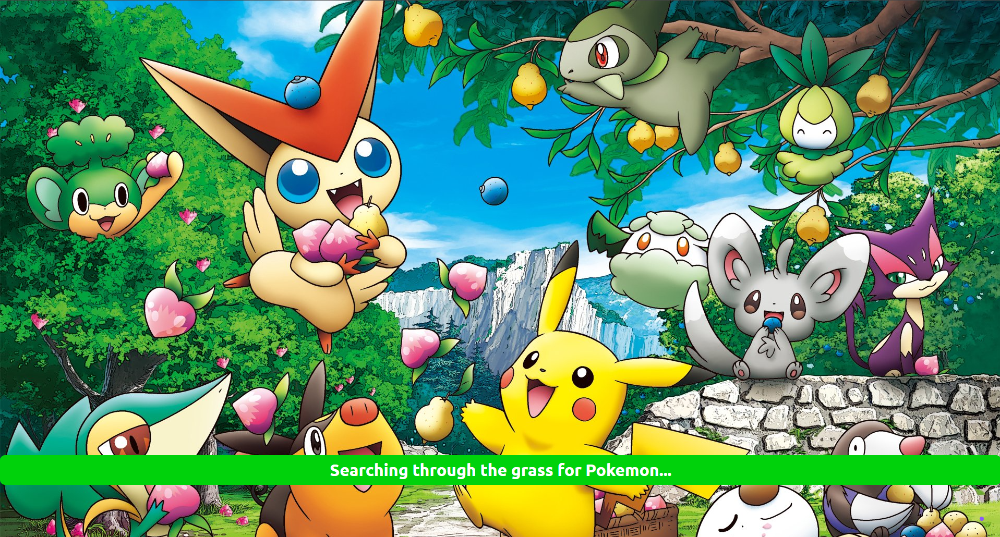

# PokeGuess

A Memory Card game that utilizes the PokeAPI and incorporates React concepts like state, effects, and props. 

## Key Features
* **Random Pokemon Fetching**: Get a random selection of Pokemon as your memory cards
* **Loading State**: See a loading screen while fetching occurs instead of blank page
* **Responsive Design**: Fully optimized for mobile and desktop viewing.

## Pictures

### Main Screen


### Loading Screen on Larger Device


### Loading Screen on Mobile Device


## Project Structure 
```text
memory_card
├── README.md
├── eslint.config.js
├── index.html
├── package-lock.json
├── package.json
├── public
│   ├── favicon.svg
│   ├── icons.svg
│   ├── loading-screen-big.png
│   ├── loading-screen-small.png
│   └── main-screen-big.png
├── src
│   ├── App.css
│   ├── App.jsx
│   ├── assets
│   │   ├── pokebackground-small.jpg
│   │   └── pokebackground.jpg
│   ├── components
│   │   ├── Card.jsx
│   │   ├── CardHolder.jsx
│   │   └── PokeForm.jsx
│   ├── data
│   │   ├── pokeData.js
│   │   └── shuffle.js
│   └── main.jsx
└── vite.config.js
```

## What I learnt
* **Custom Hooks**: allowing components to "subscribe" to certain state that involves fetching of data
* **Fetching Data Reset**: tried to place an object property of "isClicked" onto pokemon objects but fetching resets that
* **Usage of Sets to keep track of clicks**: Sets allow you to keep a unique set of values and access them in 0(1) time

## Future Features to Add
* **Improved UI Design**: add more design and creativity to the project (wanted to focus more on fetching data)
* **Increased User interactivity**: allow users to give a range of Pokemon IDs for a list of Pokemon in a specific region (for example, the Kalos Region)
* **Loading Screen Animation**: add a pokemon running across the screen or at least the circular loading icon

## Attributions to Images

* **pokebackground.jpg**: https://wall.alphacoders.com/big.php?i=592678
* **pokebackground-small.jpg**: https://www.deviantart.com/fryquest/art/Pokewallpaper-958597774
